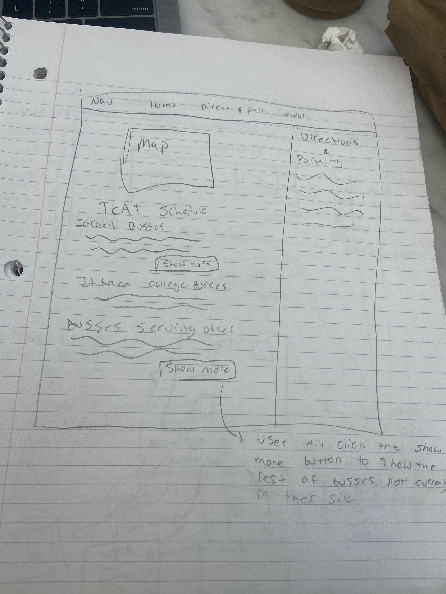

# Project 3: Design Journey

**For each milestone, complete only the sections that are labeled with that milestone.**

**Replace ALL _TODOs_ with your work.** (There should be no TODOs in the final submission.)

Be clear and concise in your writing. Bullets points are encouraged.

**Everything, including images, must be visible in Markdown Preview.** If it's not visible in Markdown Preview, then we won't grade it. We won't give you partial credit either. This is your warning.

# Existing Project

**Tell us about the project you'll be using for Project 3.**

## Project (Milestone 1)
> Which project will you add interactivity to enhance the site's functionality?

Project 2

## Audience (Milestone 1)
> Who is your project site's audience?
> This should be the original audience from Project 1 or Project 2.
> You should adjust the audience if necessary. Just make sure you explain your rationale for doing so here.

My sites audience will mainly consist of residence local to the greater Ithaca area as well as Cornell and Ithaca College students. The audience of the site will likely be from age about age 8 to senior citizen. These people are looking to potentially attend apple fest or other town events. These group of people make sense as my audience because their chances of going to the festival increase due to their proximity/ desire to be involved in Ithaca run events.

## Audience's Goals (Milestone 1)
> List the audience's goals that you identified in Project 1 or 2.
> Just list each goal. No need to include the "Design Ideas and Choices", etc. You may adjust the goals if necessary. However, any changes you make to the goals for this project should be clearly identified and justified.

- Displaying Peak hours of Festival traffic
-  using design, structure, or layout to put emphasis on what time the festival is open
- Communicate to users that some of the vendors will only take cash payment
- Make it to clear to the users what sort of vendors/ entertainment are at the festival

# Interactivity Design

## Interactivity Brainstorm (Milestone 1)
> Using the audience goals you identified, brainstorm possible options for interactivity to enhance the functionality of the site while also assisting the audience with their goals.
> Briefly explain idea each idea and provide a brief rationale for how the interactivity enhances the site's functionality for the audience.
> Note: You may find it easier to sketch for brainstorming. That's fine too. Do whatever you need to do to explore your ideas.

- Show more element for TCAT  busses - if you want to scroll to other or Ithaca college busses you don’t want to scroll through all pages first so show more will shrink the page - especially in mobile
- Turn TCAT schedule into accordion menu
- Adding slideshows for all of the vendors - therefore more ppl can see more images for the different vendors exposing more content
- Create a slideshow of vendors and content
- make the bring cash banner to ensure people see it
- Have busiest hours display differently each day under the graph.

## Interactivity Proposal & Rationale (Milestone 1)
> Make a decision about your site's interactivity. Explain what you plan to implement and where it will go on your site.
> Describe the purpose of your proposed interactivity. Provide a brief rationale explaining how your proposed interactivity addresses the goals of your site's audience.

**Interactivity Proposal:**
show more / show less element to hide the long list of busses

**User Goals Rational:**
I plan on using the show more element for the busses. This is because I know that the user has short attention span for the site, so if they want to find a TCAT they won’t want to scroll forever. This will align with the users goals well because it will allow them to have  more time to dedicate to exploring other parts of the website like vendors

**Interactivity Proposal:**   
implement a carousel for all of the vendors
**New Implementation**
It was impossible to meet my audiences goals with this so I decided to implement a carousel with images of the festival on the homepage instead.

**User Goals Rational:**
I also want to implement a carousel for all of the vendors. However, I want to make sure it is still obvious that there are other vendors available. This will meet my goals of holding the users attentions while showing them vendors.
**New Implementation**
This will meet my goal of intriguing the user and letting them see the variety of things going on during the festival. This will meet my design goal because the user can click through images on the homepage to see some of things available at the festival.

**Interactivity Proposal:**
implement a banner prompting the user to bring cash

**User Goals Rational:**
When I ran my user test it was clear that none of them saw the reminder to bring cash, which was one of my goals of the site that were not met. Therefore, I wanted to implement this banner so as the user scrolls they have to see that you need to bring cash, and they can not miss it and even have to press a button to get rid of it.

## Interactivity Design Ideation (Milestone 1)
> Now that you've made a decision about the site's interactivity, explore the possible design solutions for the interactivity.
> Sketch several iterations of your interactivity.
> Annotate each sketch explaining what happens when a user takes an action. (e.g. When user clicks this, this happens.)

I was debating whether I should make my final design look like a a pop up window or a banner. I ultimately decided that a banner would be best because it doesn't crowd the design, but still forces the user to look at it as the scroll through the page.

Here I was debating whether or not I wanted to show a few of the busses before the show more button or not. I decided that showing a few of the busses was not the best design this was mostly because the Ithaca busses only have one section listed. Therefore, the user will be confused: if I don't use a show more button the user might think is it missing? or if I do use it there won't be enough feedback provided because the busses won't expand and the user may think is the button broken?

Here I was debating whether the slides should be all the vendors with the entertainment on top or if the slide show should include entertainment. I ultimately decided that I should not include the entertainment in this because the topics aren't closely enough related.
**I later decided hiding the vendors at all did not match my design goals and decided to use slideshow elsewhere**

## Final Interactivity Design (Milestone 1)
> Review your sketches from the previous step and pick your final design.
> Create a _polished_ sketch (it's still a sketch, but with a little more care taken to communicate ideas clearly to the graders) to plan your interactivity.
> **Sketch out the entire page where your interactivity will go.** Add your interactivity to the sketch. Add any annotations to explain what happens when the user takes an action.
> Include as many sketches as necessary to communicate your design (ask yourself, could another 1300 take these sketches an implement my design?)

After trying to intially implememnt my slide-show I realized that it didn't suit the needs of my audeice well. My original slideshow hid the different vendors when one of my goals of my project 2 was for the audience to know more about what is going on the festival. Therefore, I red-designed my slide-show to implement it on the home page of my wesbite. This way the slide-show would show-case differnt picturs from the festival to intrigue the audience and get them to attend. This is my updated sketch that shows the images that I will use to implement this design.

When I was reviewing my design for its usability I noticed that not having a dot to inidcate the current slide or a dot button you could press to change slides affected the overall usability. It limited both the feedback and the accessibility of the design. Thereofre, in this new design I added these dot buttons.

After I started designing the show-more interactivity, I realized that I had overlooked needing a show-less button, so that the design would be more accessible. Moreover, I didn't think about how not hiding the show less button after clicking on it would be confusing for the user. Therefore, I implmeented both of these design choices in this redesign.

## "Ambitious" Interactivity Explanation
> In your own words, concisely explain why you believe your interactivity meets the "ambitious" requirement.

Yes, I believe my plan meets the ambitious requirement bc slideshows/ carousels are considered ambitious elements. Moreover, I will be implementing two smaller less ambitious elements like show more and banner elements. This will create a total of three elements. Also just the slideshow satisfies the the 3 events on 3 different elements with the foward arrow the backward arrow and the dots.      

## Additional Information (Milestone 1)
> (optional) Include any additional information, justifications, or comments we should be aware of.

As mentioned previously, I decided to change my carsoul design to better match my users goals and give them a sense of what the festival is like through imagery right on the homepage

# Interactivity Implementation Plan (Final Submission)

## HTML Interactivity Plan (Final Submission)
> Plan the HTML elements you will use in your interactivity.
> For each element, give its `id=` (if it has one) and any default styling (`class=`)

**After starting implementing I realized my original plan for the slide code was not accurate when looking at the snippets**
- id="home-slides"
- id="slide1" class="slide"
- id="slide2" class="slide"
- id="slide3" class="slide"
- id="slide4" class="slide"
- id= "forward-button"
- id = "back-button"
- id = "dot1" class="dots"
- id "dot2" class="dots"
- id = "dot3" class="dots"
- id "dot4" class="dots"

- id=cornell-busses
- id=ithaca-busses
- id=other-busses
- id='c-button' class= "c-button"
- id='i-button' class= "i-button"
- id='o-button' class= "o-button"

**After starting implementing I realized I needed a show less button**

- id='c-less-button' class= less-button
- id='i-less-button'  class= less-button
- id='o-less-button'  class= less-button
- id='c-button-hidden' class= "c-button"
- id='i-button-hidden' class= "i-button"
- id='o-button-hidden' class= "o-button"

## CSS Interactivity Plan (Final Submission)
> Plan the CSS classes you will need for your interactivity

- .hidden - display hidden

### banner css classes

- .strong-banner - position sticky to top, white background color white (maybe opacity), flex with button so that button displays to the right of the banner about cash
- #cash-banner button - adjust size for the banner, change color, use pointer cursor

### show more css classes

- c-button- flex-start, margin-left so that the show more is near the busses heading, change to light red, underline
- i-button - flex-start, margin-left so that the show more is near the busses heading, change to light red, underline
- o-button - flex-start, margin-left so that the show more is near the busses heading, change to light red, underline
- less-button - change to light red, underline

### slide show css classes

- home-slides - to iterate through slides, create a flex box so that back arrow is on left and forward arrow on right
- slide - show what side you are iterating through
- .home-slides button - make maroon, adjust size, cursor is pointer
- .home-slides button:hover - turn grey when scrolled over
-  dots- styling and centering them
- dotChange - changing the color of the dot when its pressed on or active on screen, creating a cursor feature

## Interactivity Pseudocode (JavaScript) Plan (Final Submission)
> Write your interactivity pseudocode plan here.

####Psuedocode for Cash-banner

   if #cash-exit-button is clicked
     add .hidden CSS class to #cash-banner

####Psuedocode for show-more

  **After starting implenenting i realized i needed a show less button, so more pseudocode was added after intial push**

  - if #c-button is clicked
    - remove .hidden CSS class from #cornell-busses
    - remove .hidden from #c-less-button
    - add .hidden to #c-button-hidden

  - if #c-less-button is clicked
    - add .hidden to #cornell-busses
    - add .hidden to #c-less-button

  - if #i-button is clicked
    - remove .hidden CSS #ithaca-busses
    - remove .hidden from #i-less-button
    - add .hidden to #i-button-hidden

  - if #i-less-button is clicked
    - add .hidden to #ithaca-busses
    - add .hidden to #i-less-button

  - if #o-button is clicked
    - remove .hidden CSS class from #other-busses
    - remove .hidden from #o-less-button
    - add .hidden to #o-button-hidden

  - if #o-less-button is clicked
    - add .hidden to #other-busses
    - add .hidden to #o-less-button

####Psuedocode for slides

**After starting implementing I realized my original plan for the slide code was not accurate when looking at the snippets**

- if the #forward-button is clicked
  - add .hidden to slide (x) and remove .hidden slide (x+1)

- if the #backward-button is clicked
  - add .hidden to slide(x) and remove .hidden slide(x-1)

- when #foward-button is clicked
  - remove .change from dot(x) and add .changeDot to dot(x+1)

- when #backward-button is clicked
  - remove .change from dot(x) and add .changeDot to dot(x-1)

- if the #dot1 is clicked
  - add .changeDot to the #dot1

- if the #dot2 is clicked
    - add .changeDot to the #dot2

- if the #dot3 is clicked
  - add .changeDot to the #dot3

- if the #dot4 is clicked
  - add .changeDot to the #dot4

# Grading (Final Submission)

## Interactivity Usability Justification (Final Submission)
> Explain how your design effectively uses affordances, visibility, feedback, and familiarity.

### Cash-banner usability

- **affordances** - This design does have a visible affordance of the "OK, Got it Button". This button is filled in red, so that the user can see that it is possible something to inteact; morever, the button has an outline to get it to pop off the screen a bit. The button also has the affordances of the cursor turning to a pointer when the user scrolls over it. Additionally, when the user scrolls over the button it will turn from maroon to crimson to indicate that the user can click on it.
- **visibility**- This design has good visibility the banner sticks to the page so that the user will defiently see it. Moreover, the button is red and sticks out so that the user can easily spot it and remove the banner.
- **feedback** - The design does a good job giving feedback because when the user presses the "Ok, got it" button the banner goes away. This is a clear way to indicate to the use that the actions that they set out to complete was fulfilled.
- **familiarity** - This design is familiar. This design follows the conventions of the typical cookie-banner where there is a message and a button to "accept" or "ok got it" that causes the banner to disappear.

###  usability

- **affordances** - The carousel makes good use of affordances as it contains both a forward and backward arrow that indicate that you should click there to move the carousel along. Moreover, this design makes good use of affordances as it utilizes a hover feature so when the buttons are hovered over they change color to indicate to the user that they can click here. In order, to further indicate that the user can click on the arrows the cursor changes to a pointer when scrolled over the arrow. Some of the affordances that this slide-show lacks is a thumbnail, but it does have dots at the bottom of the screen that change from marroon to crimson to show what slide the user is currently on.
- **visibility** - This design does lack some visibility because the hidden class removes the images from the view of the screen-readers (this style coding doesn't match the snippets we were given). It also has good visibility again with the buttons, so that the user knows exactly what point they are at in the carousel
- **feedback** - This design gives feedback when the slide changes because that indicates that when the user clicks the arrow that an action occurs.
- **familiarity** This is a familiar design. This is because the design uses the same design conventions seen across the internet for a carousel with arrows and changing pictures.

## show more usability

- **affordances** - Even though this design doesn't contain as clear of a button as the other two. It has the "show more" and "show less" words that are familiar enough to the user that they know to click on them. Moreover, the "show more" and "show less" buttons are underlined to show to the user that they might be able to interact with them. The design also has a pointer as a cursor available when the buttons are scrolled over.
- **visibility** - The design has good visibility because the "show more" buttons are located right below the bus lists that they will expand, and the "show less" button is right under the bus list. However, the bus lists start out using the class hidden, so they aren't available to screen reader, so there is a lack of visibility present there.
- **feedback** - This design provides adequate feedback to the user. Firstly, all of the buses are shown when the user clicks the "show more" button, which shows that an action has been completed. Moreover, when this happens the "show more" button disappears. This indicates to the user that there is no more information to be shown. When the "show less" button is pressed the feedback is provided because the busses disappear, and the "show more" button comes back showing that the user successfully hid the information.
- **familiarity** - This design is familiar as it follows the conventions of other show more buttons online. Similar to other "show more"/ "show less" buttons, the button is available where the information is hidden and clicking on "show more" will reveal it, while clicking "show less" will hide it.

## Additional Design Justifications (Final Submission)
> If you feel like you haven’t fully explained your design choices in the final submission, or you want to explain some functions in your site (e.g., if you feel like you make a special design choice which might not meet the final requirement), you can use the additional design justifications to justify your design choices. Remember, this is place for you to justify your design choices which you haven’t covered in the design journey. Use it wisely. However, you don’t need to fill out this section if you think all design choices have been well explained in the final submission design journey.

For the "show-more" / "show-less" section, I used less affordances in this design because it is so familiar to the user that with just the pointer icon it is clear this can be pressed on. It echos a design similar to that of a hyperlink (although it is not a hyperlink0, but the underlined different colored text is something universally known that you can click on it. Moreover, using less affordances here allowed me to maintain the simpler design that I was going for.

## Tell us What to Grade (Final Submission)
> We aren't re-grading your Project 1 or 2. We are only grading the interactivity you added.
> Tell us where (what page) we can find your interactivity and how to use it.
> **We will only grade what you list here;** if it's not listed, we won't grade it.

### The Cash Banner
- Location: index.html (homepage)
- How to use: In order to use this interactivity, you have to press the "Ok,Got It!" button and the banner will disappear.

### Slide show:
- Location: index.html (homepage)
- How to use: In order to use this interactivity, press the ">" button to move the slideshow forward and view the images in the forward direction, and press the "<" button to move the slideshow and view the images in the backward direction.

### Show more/ show less:
- Location: directions.html (directions and parking)
- How to use:  In order to use this interactivity, press the "show more" button under any of the busses (cornell, ithaca, other), and the buss list will expand. Then to mimiize the busses press the "show less" button.

## Additional Resources/References (Final Submission)
> If you referenced other websites (or sources, including tutorials) on this project, list them here.

- snippets document

## Self-Reflection (Final Submission)
> This was the first project in this class where you coded some JavaScript. What did you learn from this experience?

From this project, I got to learn how CSS and HTML can interact to create an experience for the user. I struggled a little bit with the java script, especially when it came to some of the more advanced coding like the slide deck. However, I was still able to learn how pressing a button can be used to remove or add hidden classes to HTML. Moreover, when implementing the slideshow, I got to understand a little bit about how functions worked in javascript because when the forward and back buttons are pressed they call the prevSlide and nextSlide functions, which then can be repeated anytime that that same button is pressed. Overall, I feel like I was able to use the snippets provided in class to begin my understanding of interactivity

> Reflect on how HTML, CSS, and JavaScript together support client-side interactivity. If it's helpful, you can describe your mental model of client-side interactivity or explain how the general idea of showing and hiding content can be used to implement other forms of client-side interactivity beyond what you've done in this project.

HTML, CSS, and Javascript work together to generate client-side activity because the .hidden class in CSS is able to hide or reveal certain aspects of the website to the user. This action is triggered when a button is clicked in HTML. In order, for the user to see the result of a banner disappearing or a slide revealing itself the two elements must work together. This is where javascript is used so that when you press a button element in HTML the .hidden class may be added or remind to generate an action. This is important because all the client sees is the end result of somethings appearance in the website altering. Furthermore,  beyond the scope of this project, a .hidden class could be used on a hamburger menu where the menus you is set to .hidden and then when the user hovers or clicks on the menu (a button element in HTML), removeClass(.hidden) is implemented, so that the rest of the menus is revealed the user. Here is an example of all three codes working together because the user presses a button in HTML that using javascript triggers a change in classes in the CSS being used on the element.

> Take some time here to reflect on how much you've learned since you started this class. It's often easy to ignore our own progress. Take a moment and think about your accomplishments in this class. Hopefully you'll recognize that you've accomplished a lot and that you should be very proud of those accomplishments!

I feel like I have learned a lot in this class, even though I have coding experience I have never coded a website. However, now I can code HTML, CSS, and some Javascript. I also have learned so much about the design journey, and how helpful it is to plan before you code, so that you can ensure that the site meets your audience's needs.  This class well at times challenging has made me feel proud of all that I have been able to learn about web design.
